# 简介

## 区块链简介

区块链技术是一项去中心化技术，依靠分布式记录与密码学生成块，每个块上的最末端记录与下一块最顶端记录是一样的，从而形成链；

每个人都可以记录块，而且可以查看别人的记录，所以是点对点的；

区块链1.0的产物是比特币；

区块链出现在2008年，由中本聪提出；

## 以太坊简介

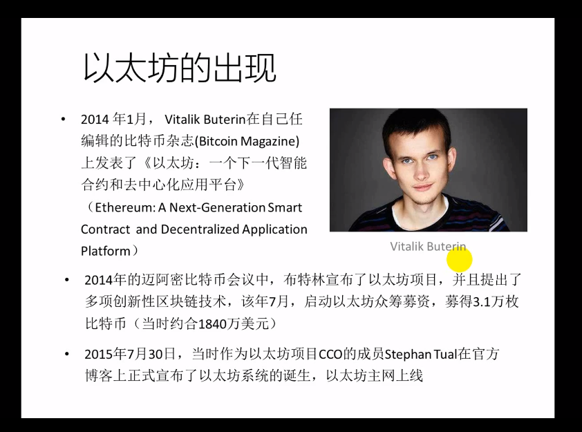

以太坊出现在2014年，也可以称为区块链2.0，每个块上可以运行智能合约，智能合约是对数字货币进行编程的能力；

以太坊的产物是以太币；

每一笔交易会消耗燃料gas，gas有最大值；

挖矿奖励：区块奖励，叔块奖励，叔块引用奖励

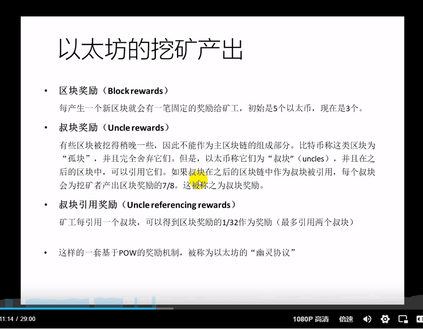

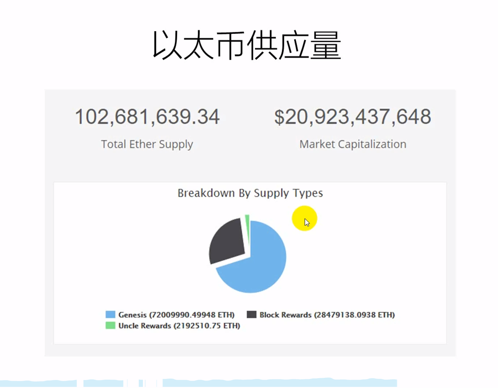

奖励政策：发现叔块是大概奖励7/8  叔块引用奖励是1/32

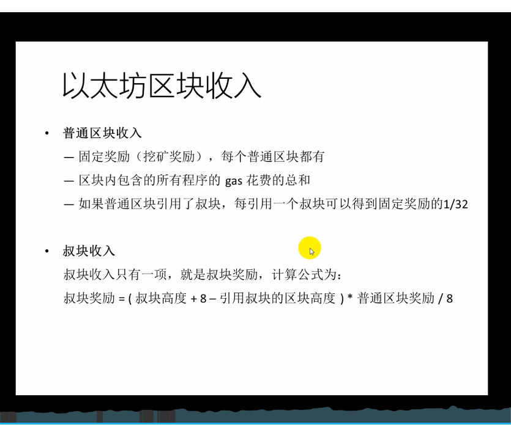

# 以太坊钱包

## Metamask安装

安装的是谷歌浏览器插件 Metamask

1、谷歌浏览器拓展商店搜索 Metamask 注意识别钓鱼插件

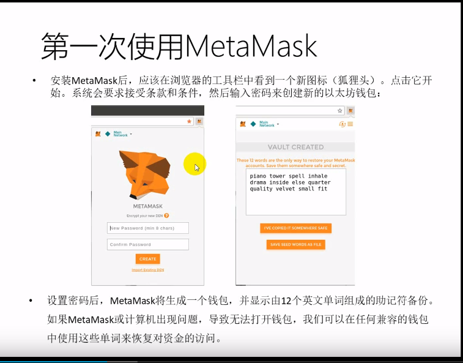

2、牢记助记词，不要存储在电脑磁盘中，用物理方式存储，备份2份；

助记词就相当于密钥，千万不能暴漏的东西；

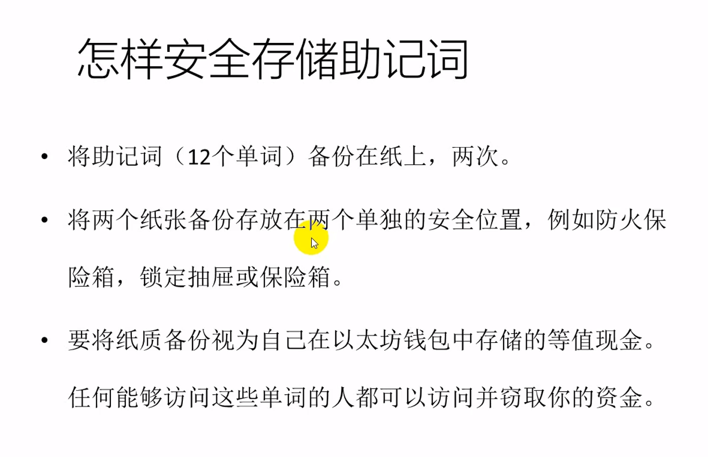

3、永远要有一个安全意识；

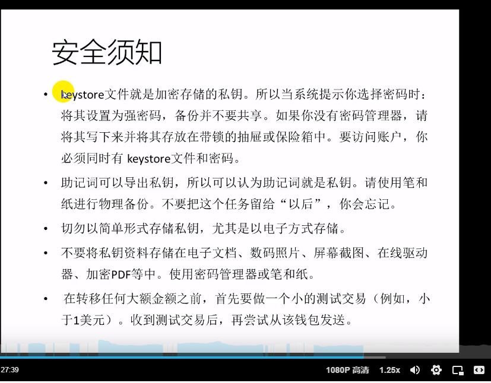


## Metamask使用

1、界面可以设置网络，主网络上是真实的以太币；

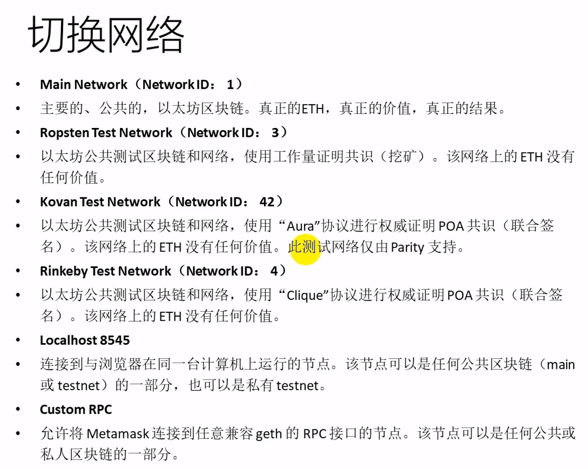

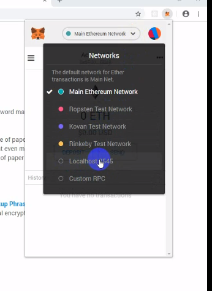

切换不了网络的话:

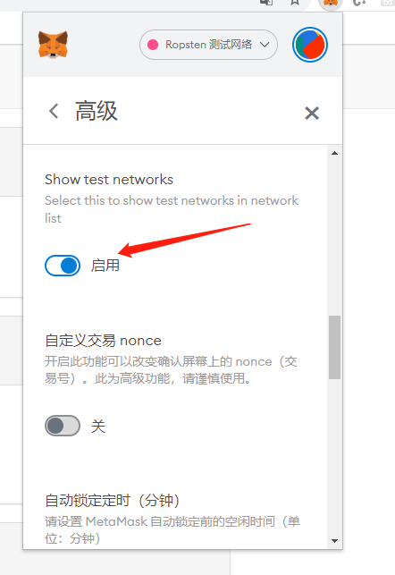


2、在ropsten网络上获取以太币

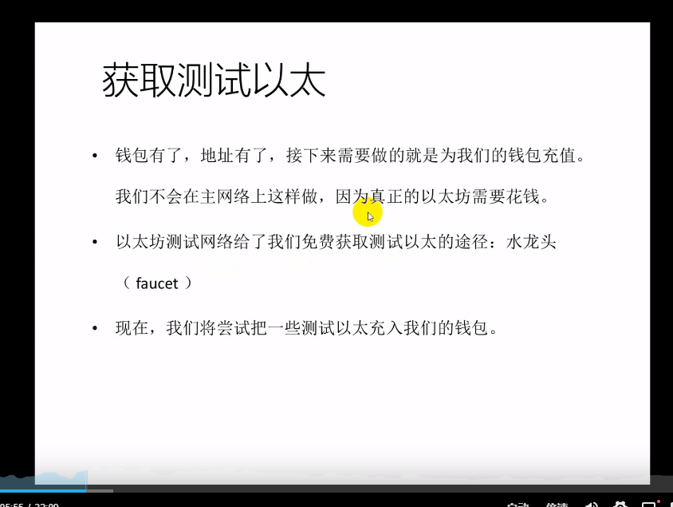

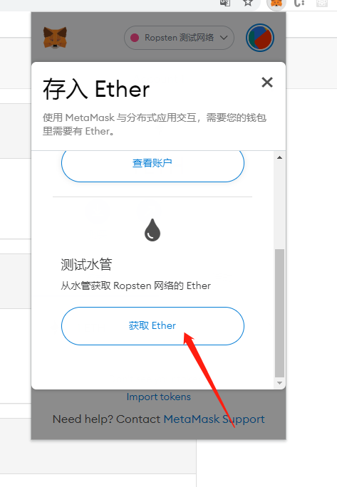

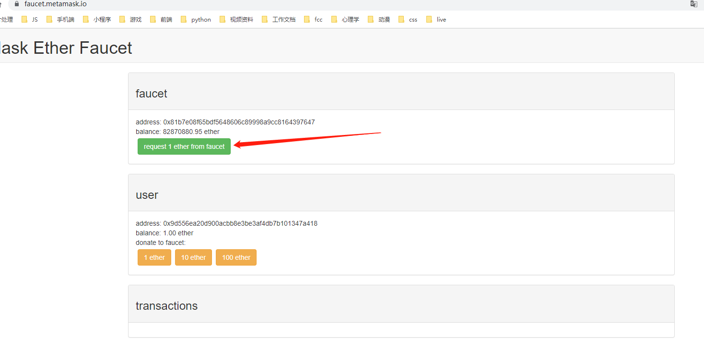


# geth 

## 主要命令行
1.创建钱包账户

    geth account new --datadir data

2.创建创世块 需要 genesis.json 文件

```json
    {
  "config": {
    "chainId": 15,
    "homesteadBlock": 0,
    "eip150Block": 0,
    "eip155Block": 0,
    "eip158Block": 0,
    "byzantiumBlock": 0,
    "constantinopleBlock": 0,
    "petersburgBlock": 0,
    "ethash": {}
  },
  "difficulty": "1",
  "gasLimit": "8000000",
  "alloc": {K,
    "368351ab52C0C0E6A957b3B168AcB265A63a8Db6": { "balance": "300000000000000" }
  }
}
```


3.初始化数据

    geth init --datadir data genesis.json


4.创建私链网络

    geth --datadir data --networkid 15 --http console 2>2.log


5.开发模式 

    geth --datadir data --http --dev console 2>1.log

6.操作类命令

01：查看当前存在的账户

    eth.accounts

    []

默认不会有账户信息，需要创建后才能有

02：创建账户，注意传入的123是密码

    personal.newAccount("123")

    "0x70aea0aea5bf9568a650598dfef44d6d3cca209a"

    eth.accounts

    ["0x70aea0aea5bf9568a650598dfef44d6d3cca209a"]

03：启动挖矿，start内的1是代表1个线程挖矿，null并非代表错误

    miner.start(1)

    null


04：查看账户余额，都是挖矿所得

    eth.getBalance(eth.accounts[0])

    95000000000000000000

05：再创建一个账户，密码456

    personal.newAccount("456")

    "0xd56f07dc185c32f0367469b353c6cae711fa4a46"

06：给两个账户起别名acc0，acc1

    acc0=eth.accounts[0]

    "0x70aea0aea5bf9568a650598dfef44d6d3cca209a"

    acc1=eth.accounts[1]

    "0xd56f07dc185c32f0367469b353c6cae711fa4a46"

07：解锁账户1 坑：http模式下无法解锁 用的dev

    personal.unlockAccount(acc0)

    Unlock account 0x70aea0aea5bf9568a650598dfef44d6d3cca209a

    Password: 

    true


08：转账给账户2，10个ether

    eth.sendTransaction({from:acc0,to:acc1,value:web3.toWei(10)})

    "0x0ccfda6137ca5c9095f03498404223ae08910d811ab7b1a7497abe3834f9fae9"

09：查看账户2余额

    eth.getBalance(acc1)

    10000000000000000000

10：退出geth

    exit


# 智能合约

## 开发环境搭建


Truffle框架是流行的以太坊开发框架，内置了智能合约编译、链接、部署等功能。

npm install -g truffle

Ganache

在实际的以太坊网络上测试、部署Dapp或智能合约，需要消耗Gas。Ganache可以在本地创建区块链网络来测试我们的程序。                                                                                                                                                                                                          


