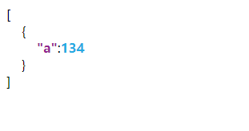

# JSONFormat

核心代码

需要引入jquery 和 bignumber两个库


```js

        /*!
        * jQuery Json Plugin (with Transition Definitions)
        * Examples and documentation at: http://json.cn/
        * Copyright (c) 2012-2013  China.Ren.
        * Version: 1.0.2 (19-OCT-2013)
        * Dual licensed under the MIT and GPL licenses.
        * http://jquery.malsup.com/license.html
        * Requires: jQuery v1.3.1 or later
        */
        var JSONFormat = (function () {
            var _toString = Object.prototype.toString;
            var _bigNums = [];
            function format(object, indent_count) {
                var html_fragment = '';
                switch (_typeof(object)) {
                    case 'Null': 0
                        html_fragment = _format_null(object);
                        break;
                    case 'Boolean':
                        html_fragment = _format_boolean(object);
                        break;
                    case 'Number':
                        html_fragment = _format_number(object);
                        break;
                    case 'String':
                        //replace blank to html blank to display in html.
                        object = object.replace(/ /g, "&nbsp;");
                        html_fragment = _format_string(object);
                        break;
                    case 'Array':
                        html_fragment = _format_array(object, indent_count);
                        break;
                    case 'Object':
                        if (object instanceof BigNumber) {
                            html_fragment = _format_number(object.toFixed());
                        } else {
                            html_fragment = _format_object(object, indent_count);
                        }
                        break;
                }
                return html_fragment;
            };

            function _format_null(object) {
                return '<span class="json_null" contenteditable="true">null</span>';
            }

            function _format_boolean(object) {
                return '<span class="json_boolean" contenteditable="true">' + object + '</span>';
            }

            function _format_number(object) {
                return '<span class="json_number" contenteditable="true">' + object + '</span>';
            }

            function _format_string(object) {
                object = object.replace(/\</g, "&lt;");
                object = object.replace(/\>/g, "&gt;");
                if (0 <= object.search(/^http/)) {
                    object = '<a href="' + object + '" target="_blank" class="json_link">' + object + '</a>'
                }
                return '<span class="json_string" contenteditable="true">"' + object + '"</span>';
            }

            function _format_array(object, indent_count) {
                var tmp_array = [];
                for (var i = 0, size = object.length; i < size; ++i) {
                    tmp_array.push(indent_tab(indent_count) + format(object[i], indent_count + 1));
                }
                return '<span data-type="array" data-size="' + tmp_array.length + '"><i  style="cursor:pointer;" class="fa fa-minus-square-o" onclick="hide(this)"></i>[<br/>'
                    + tmp_array.join(',<br/>')
                    + '<br/>' + indent_tab(indent_count - 1) + ']</span>';
            }

            function _format_object(object, indent_count) {
                var tmp_array = [];
                for (var key in object) {
                    var keyRe = key.replace('jsondotcnprefixyxp', '');
                    tmp_array.push(indent_tab(indent_count) + '<span class="json_key" contenteditable="true">"' + keyRe + '"</span>:' + format(object[key], indent_count + 1));
                }
                return '<span  data-type="object"><i  style="cursor:pointer;" class="fa fa-minus-square-o" onclick="hide(this)"></i>{<br/>'
                    + tmp_array.join(',<br/>')
                    + '<br/>' + indent_tab(indent_count - 1) + '}</span>';
            }

            function indent_tab(indent_count) {
                return (new Array(indent_count + 1)).join('&nbsp;&nbsp;&nbsp;&nbsp;');
            }

            function _typeof(object) {
                var tf = typeof object,
                    ts = _toString.call(object);
                return null === object ? 'Null' :
                    'undefined' == tf ? 'Undefined' :
                        'boolean' == tf ? 'Boolean' :
                            'number' == tf ? 'Number' :
                                'string' == tf ? 'String' :
                                    '[object Function]' == ts ? 'Function' :
                                        '[object Array]' == ts ? 'Array' :
                                            '[object Date]' == ts ? 'Date' : 'Object';
            };

            function loadCssString() {
                var style = document.createElement('style');
                style.type = 'text/css';
                var code = Array.prototype.slice.apply(arguments).join('');
                try {
                    style.appendChild(document.createTextNode(code));
                } catch (ex) {
                    style.styleSheet.cssText = code;
                }
                document.getElementsByTagName('head')[0].appendChild(style);
            }

            loadCssString(
                '.json_key{ color: #92278f;font-weight:bold;}',
                '.json_null{color: #f1592a;font-weight:bold;}',
                '.json_string{ color: #3ab54a;font-weight:bold;}',
                '.json_number{ color: #25aae2;font-weight:bold;}',
                '.json_boolean{ color: #f98280;font-weight:bold;}',
                '.json_link{ color: #61D2D6;font-weight:bold;}',
                '.json_array_brackets{}');

            var _JSONFormat = function (origin_data) {
                // this.data = origin_data ? origin_data :
                //     JSON && JSON.parse ? JSON.parse(origin_data) : eval('(' + origin_data + ')');
                let stringedJSON = origin_data.replace(/([^\\]\"):\s*(\[)?([-+Ee0-9.]+)/g, '$1: $2"jsondotcnprefix$3"');
                stringedJSON = stringedJSON.replace(/\"([-+Ee0-9.]+)\"\s*:\s*/g, '"jsondotcnprefixyxp$1": ');
                try {
                    var temp = JSON.parse(stringedJSON, (key, value) => {
                        // only changing strings
                        if (typeof value !== 'string') return value;
                        // only changing number strings
                        if (!value.startsWith('jsondotcnprefix')) return value;
                        // chop off the prefix
                        value = value.slice('jsondotcnprefix'.length);
                        // pick your favorite arbitrary-precision library
                        return new BigNumber(value);
                    });
                    this.data = temp;
                } catch (e) {
                    this.data = JSON.parse(origin_data);
                    console.log(e);
                } finally {

                }


                //this.data = o;//JSON.parse(origin_data);
            };

            _JSONFormat.prototype = {
                constructor: JSONFormat,
                toString: function () {
                    return format(this.data, 1);
                }
            }

            return _JSONFormat;

        })();
        var last_html = '';
        // function hide(obj){
        //     var data_type = obj.parentNode.getAttribute('data-type');
        //     var data_size = obj.parentNode.getAttribute('data-size');
        //     obj.parentNode.setAttribute('data-inner',obj.parentNode.innerHTML);
        //     if (data_type === 'array') {
        //         obj.parentNode.innerHTML = '<i  style="cursor:pointer;" class="fa fa-plus-square-o" onclick="show(this)"></i>Array[<span class="json_number">' + data_size + '</span>]';
        //     }else{
        //         obj.parentNode.innerHTML = '<i  style="cursor:pointer;" class="fa fa-plus-square-o" onclick="show(this)"></i>Object{...}';
        //     }
        //
        // }
        //
        // function show(obj){
        //     var innerHtml = obj.parentNode.getAttribute('data-inner');
        //     obj.parentNode.innerHTML = innerHtml;
        // }
        function hide(obj) {
            var data_type = obj.parentNode.getAttribute('data-type');
            var data_size = obj.parentNode.getAttribute('data-size');
            // obj.parentNode.setAttribute('data-inner',obj.parentNode.innerHTML);
            $(obj).parent().hide();
            var span = document.createElement('span');
            span.className = 'custom-plus';
            if (data_type === 'array') {
                span.innerHTML = '<i  style="cursor:pointer;" class="fa fa-plus-square-o" onclick="show(this)"></i>Array[<span class="json_number">' + data_size + '</span>]';
                $(obj).parent().before(span)
            } else {
                span.innerHTML = '<i  style="cursor:pointer;" class="fa fa-plus-square-o" onclick="show(this)"></i>Object{...}';
                $(obj).parent().before(span)
            }

        }

        function show(obj) {
            // var innerHtml = obj.parentNode.getAttribute('data-inner');
            // $(obj).parent().attr('data-inner', '');
            // obj.parentNode.innerHTML = innerHtml;
            $(obj).parent().next().show();
            $(obj).parent().remove()
        }


```


使用：

```js
  var str = '[{ "a": 134 }]';
  var result = new JSONFormat(str, 4).toString();
  console.log(result)
  $('#json-target').html(result);

```
就可以生成



观察结构发现有可收缩的图标，而且可以自定义样式

在源码中找到以下行

```js
 return '<span  data-type="object"><i  style="cursor:pointer;" class="fa fa-minus-square-o" onclick="hide(this)"></i>{<br/>'
```

参考：[源代码](https://gitee.com/srcker/json-help/tree/master)