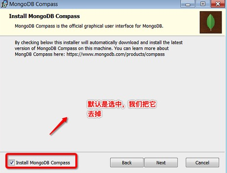

# 安装 mongodb

1、[下载地址](https://www.mongodb.com/try/download/community)

2、选择Custom 自定义安装

3、不要勾选安装MongoDB Compass图形界面管理工具

4、在 F:\mongodb\bin 运行命令 mongo 即开启了mongo服务 类似mysql->

:::tip
一些新版本的 MongoDB 安装时已经自行完成大部分配置 开启了mongo会生成 db，log两个文件夹,而且自动开启了windows服务
:::

5、打开 windows 服务界面：

右键此电脑->管理  找到mongodb 服务 开启

那么在以后开机就会自动启动

也可以通过 命令行：

启动MongoDB服务 net start MongoDB

关闭MongoDB服务 net stop MongoDB

6、浏览器打开 http://localhost:27017/  这个是在第4步输入mongo 后会出现的端口与地址

显示如下表示成功

# 安装 Robo 3T mogondb 可视化工具

1、[下载地址](https://robomongo.org/)

2、 

按以上步骤连接 mongondb

# 安装 mongodb databsetools 备份和恢复数据

1、[下载地址](https://www.mongodb.com/try/download/database-tools)

2、 

3、解压到F:\mongodb\bin  只要下面两个

mongodbdump:备份

mongorestore：恢复

4、直接输入shell命令即可

mongodbdump:

会在当前目录生成dump文件夹  

elm:表示库名

elm里面的json文件就是数据

mongorestore：

同理也是 新建dump文件 里面新建.库名文件夹  .库名文件夹内部存入一些json文件 输入mongorestore：就可以恢复数据至mongodb 

