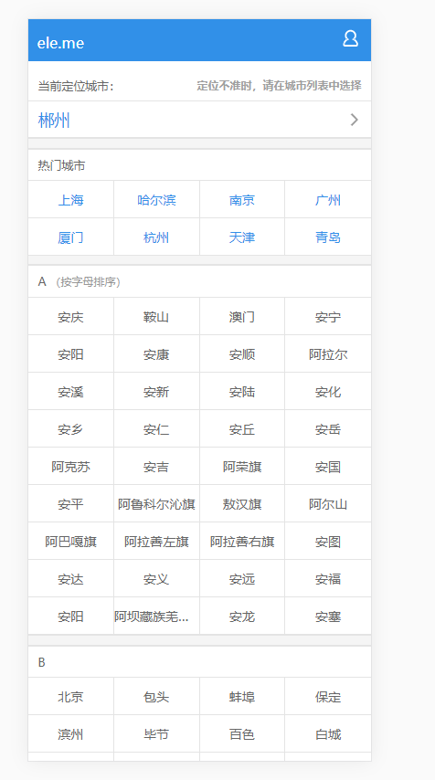
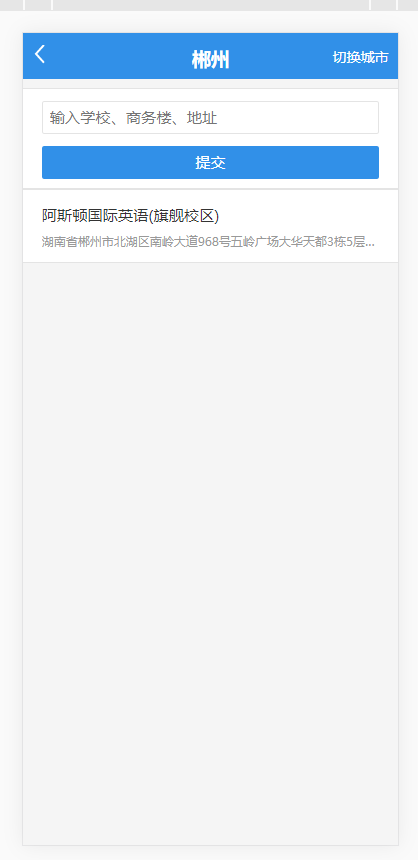
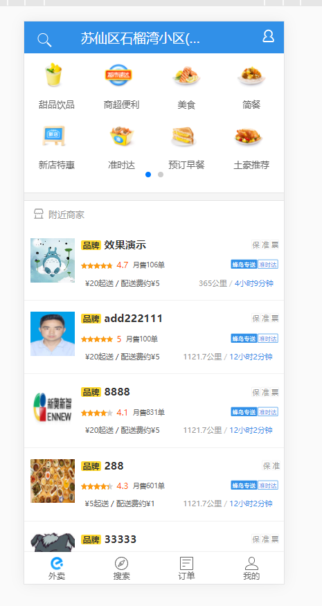
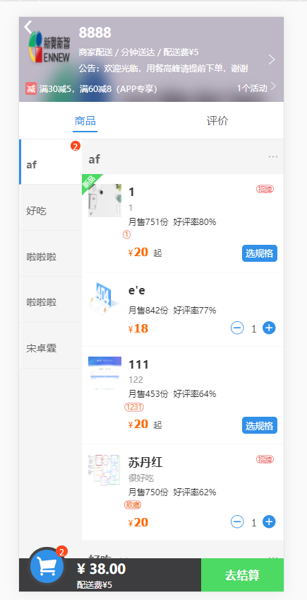
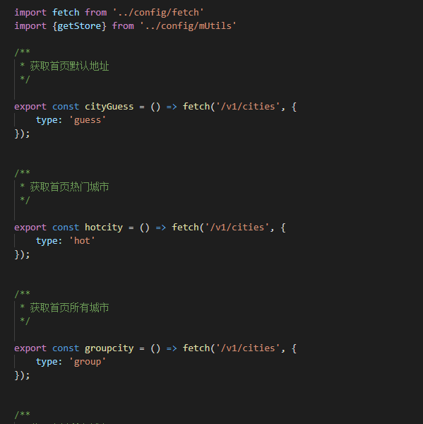
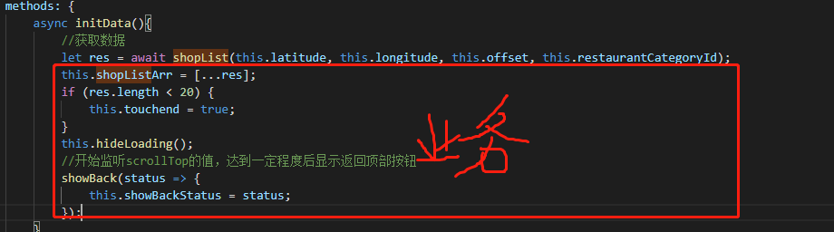

# 第1页：定位及城市排序




## 定位当前城市

nodejs中通过以下的方式获取ip
```js
let ip = req.headers['x-forwarded-for'] || 
        req.connection.remoteAddress || 
        req.socket.remoteAddress ||
        req.connection.socket.remoteAddress;
```

然后整合百度地图api 传入ip后解析出地址 再返回到前端


## 城市排序 

数据接口返回的城市顺序不是A-Z,通过遍历A-Z(65-90)的asll码值

```js
      sortgroupcity(){
            let sortobj = {};
            for (let i = 65; i <= 90; i++) {
                if (this.groupcity[String.fromCharCode(i)]) {
                    sortobj[String.fromCharCode(i)] = this.groupcity[String.fromCharCode(i)];
                }
            }
            return sortobj
        }
```

# 第2页：详细定位到写字楼



## 搜索写字楼

通过后台请求百度地图api来获得数据后返回前端

没有做分页就是最多返回10条
```js
async searchPlace(keyword, cityName, type = 'search'){
		try{
			const resObj = await this.fetch('http://apis.map.qq.com/ws/place/v1/search', {
				key: this.tencentkey,
				keyword: encodeURIComponent(keyword),
				boundary: 'region(' + encodeURIComponent(cityName) + ',0)',
				page_size: 10,
			});
			if (resObj.status == 0) {
				return resObj
			}else{
				throw new Error('搜索位置信息失败');
			}
		}catch(err){
			throw new Error(err);
		}
	}
```

## 确定选中写字楼后要存入缓存


```js
  nextpage(index, geohash){
        let history = getStore('placeHistory');
        let choosePlace = this.placelist[index];
        if (history) {
            let checkrepeat = false;
            this.placeHistory = JSON.parse(history);
            this.placeHistory.forEach(item => {
                if (item.geohash == geohash) {
                    checkrepeat = true;
                }
            })
            if (!checkrepeat) {
                this.placeHistory.push(choosePlace)
            }
        }else {
            this.placeHistory.push(choosePlace)
        }
        setStore('placeHistory',this.placeHistory)
        this.$router.push({path:'/msite', query:{geohash}})
    },
```
::: tip
import {getStore, setStore, removeStore} from 'src/config/mUtils';
getStore,setStore,removeStore写成公共方法，用与获取缓存，存入缓存，删除缓存
:::


# 第3页：商品首页



## 分组轮播

```js
	for (let i = 0, j = 0; i < resLength; i += 8, j++) {
            foodArr[j] = resArr.splice(0, 8);
        }
        this.foodTypes = foodArr;
```

## 通过指令来处理下拉加载

将v-load-more分离成独立的js文件，通过mixins混入自定义指令 代码复用

原理还是根据 滚动距离 + 高度>=滚动高度 就触发；

```html
	<ul v-load-more="loaderMore" v-if="shopListArr.length" type="1"></ul>
```

详细见vue指定文档  

就是其中有个bind方法：内部判断加载到底部后执行binding.value() 

binding.value 所绑定的是loadmore函数  这个函数就是去请求分页数据后追加到现有的后面；

::: tip
binding.value  就是指令的绑定值
:::
   


# 第4页：购物车



     
## 双向联级滚动

better-scroll 来处理双向联级滚动 

但是会有卡顿，没找到原因；后发现cube-ui集成了这个插件且效果很好


## 购物车动画

购物车动画 buyCart组件：

getBoundingClientRect 获取left,top

运用了2个动画,父元素走y，子元素走x;

父元的速度运用的是贝塞尔曲线，形状是个钩子，且经过Y的负轴，就会有弹一下的效果；

子元素匀速运动，就形成了抛物线动画；


```html
<!DOCTYPE html>
<html lang="en">

<head>
    <meta charset="UTF-8">
    <meta http-equiv="X-UA-Compatible" content="IE=edge">
    <meta name="viewport" content="width=device-width, initial-scale=1.0">
    <title>Document</title>
    <style>
        .doc_wrap{
            width: 30px;
            height: 30px;
            position: absolute;
            left: 30px;
            bottom: 30px;
            transition: .55s cubic-bezier(0.3, -0.25, 0.7, -0.15);
           
        }

        .doc_wrap .doc {
            position: absolute;
            width: 30px;
            height: 30px;
            background-color: blue;
            border-radius: 50%;
            text-align: center;
            font-size: 14px;
            color: #fff;
            line-height: 30px;
            transition: .55s linear;

        }
    </style>
</head>

<body>
    <div class="doc_wrap" style="transform: translate3d(0, -600px, 0);">
        <span class="doc" style=" transform: translate3d(300px, 0, 0);">+</span>
    </div>

  

    <button id="btn">开始动画</button>
    <script>
        var btn = document.getElementById('btn');
        btn.onclick = function () {

            document.querySelector('.doc_wrap').style.transform = 'translate3d(0, 0, 0)';

            document.querySelector('.doc').style.transform = 'translate3d(0, 0, 0)';
        }
    </script>
</body>

</html>
```


# 整体架构的分析

## vuex 管理组件的数据通信

## 模块化

1、封装http请求为promise 

2、 所有的接口请求全部写到一个js文件内



3、组件尽管调用就行，为了代码更清晰可以使用async await的方式调用 

4、根据请求返回的数据做业务逻辑的处理




## 技巧

this.ratingList = [...this.ratingList,...ratingDate] 解构赋值来插入数组

class,:style使用对象的写法更清晰；